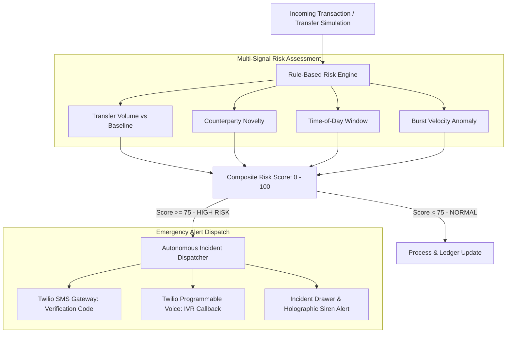

<div align="center">

# PaySphere: Intelligent Payment Simulation & Incident Dispatch

### Rule-Based Anomaly Evaluation, Multi-Channel Twilio Alerts & Interactive Incident Console

[](https://nodejs.org/)
[](https://expressjs.com/)
[](https://www.twilio.com/)
[](LICENSE)

---

> **Real-Time Financial Incident Orchestration**: An interactive fintech transaction simulation platform that evaluates payment transfers with an explainable risk engine and autonomously dispatches real-time Twilio SMS and synthesized Voice alerts during high-risk transfer anomalies.

</div>

---

## 1. System Architecture & Incident Workflow

PaySphere models an end-to-end incident response pipeline triggered by transaction anomalies:



---

## 2. Core Features

- **Rule-Based Risk Scoring**: Quantifies transaction risk (0–100) using a multi-factor heuristic engine evaluating transfer amount, beneficiary novelty, unusual transaction hours, and transfer velocity.
- **Automated Multi-Channel Telephony**: Dispatches urgent SMS notifications and initiates automated synthetic voice phone calls via Twilio when transactions trigger high-risk thresholds.
- **Interactive Security UI/UX**:
  - **3D Holographic Perspective Tilt**: Dynamic mouse-tracking CSS 3D balance card with monthly trend sparklines.
  - **Circular SVG Risk Gauge**: Visual risk breakdown displaying specific contributing factors (e.g. `+35 New Beneficiary`, `+30 Amount Surge`).
  - **Forensic Drawer**: Expandable incident drawer with transaction ID hashing, receipt export, and account lock controls.
- **Modular Backend Services**: Strict separation between `paymentService.js`, `riskService.js`, and `notificationService.js`.

---

## 3. Technology Stack

- **Backend Runtime**: Node.js (v18+), Express.js
- **Telephony & Emergency Alerts**: Twilio Node SDK (Programmable SMS & Voice)
- **Frontend Layer**: HTML5, Vanilla JavaScript, CSS3 3D Canvas
- **Testing**: Node.js test runners (`tests/test_api.js`, `tests/test_logic.js`)

---

## 4. Project Structure

```
paysphere/
├── providers/                  # External service clients (Twilio wrapper)
├── services/                   # Business logic layer
│   ├── notificationService.js  # SMS and Voice dispatch logic
│   ├── paymentService.js       # Transaction simulation & history
│   └── riskService.js          # Heuristic scoring engine
├── tests/                      # Automated test scripts
│   ├── test_api.js
│   └── test_logic.js
├── index.html                  # Main interactive dashboard
├── login.html                  # Authentication demo view
├── script.js                   # Client-side state & UI controllers
├── style.css                   # Custom 3D UI & theme styling
├── server.js                   # Express application entrypoint
├── package.json
└── README.md
```

---

## 5. Quickstart & Installation

### Prerequisites
- Node.js v18 or higher
- Twilio Account credentials (optional for testing; mock fallback included)

### Setup Instructions

1. **Clone repository:**
   ```bash
   git clone https://github.com/Vikram30069/paysphere.git
   cd paysphere
   ```

2. **Install dependencies:**
   ```bash
   npm install
   ```

3. **Configure environment:**
   ```bash
   cp .env.example .env
   ```

4. **Run test suite:**
   ```bash
   npm test
   ```

5. **Start server:**
   ```bash
   npm start
   ```
   Open `http://localhost:3000` in your browser.

---

## 6. License

This project is licensed under the MIT License — see the [LICENSE](LICENSE) file for details.
